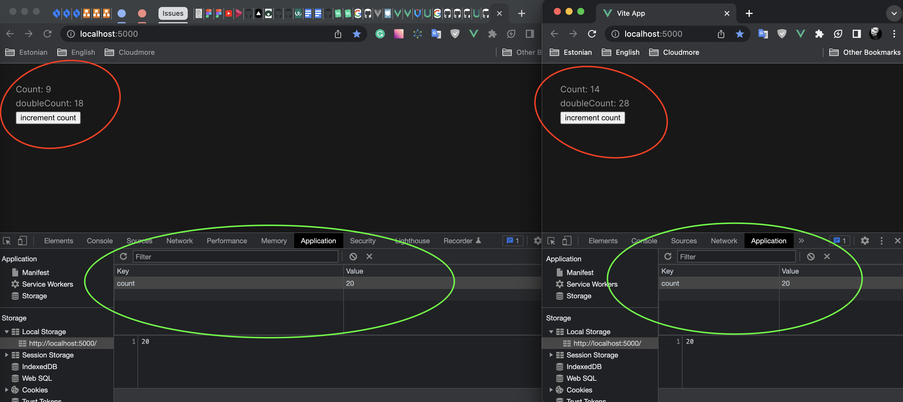

## Install and run

#### First terminal
```shell
cd host
npm i
npm run build;
npm run preview -- --port 5000
```

#### Second terminal
```shell
cd store
npm i
npm run build;
npm run preview -- --port 5001
```

### Bug
In module federation `@vueuse/core` > `useStorage` is not reactive

DOC: https://vueuse.org/core/useStorage/


open http://localhost:5000
